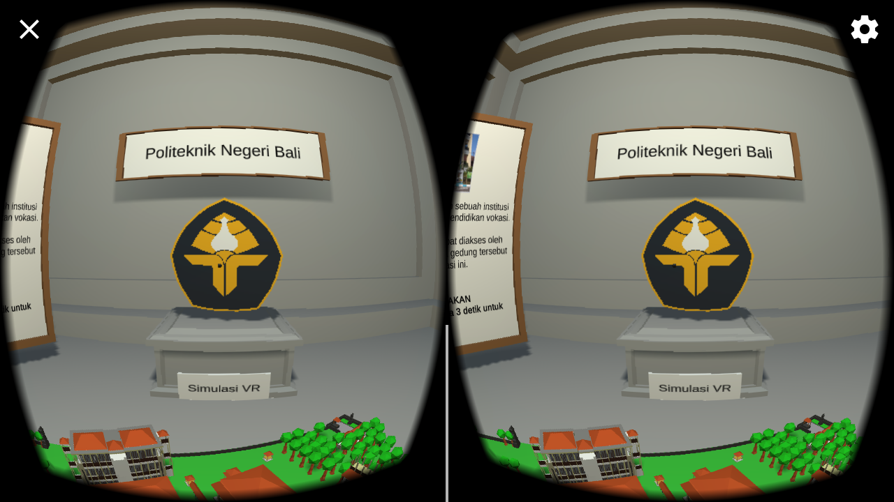
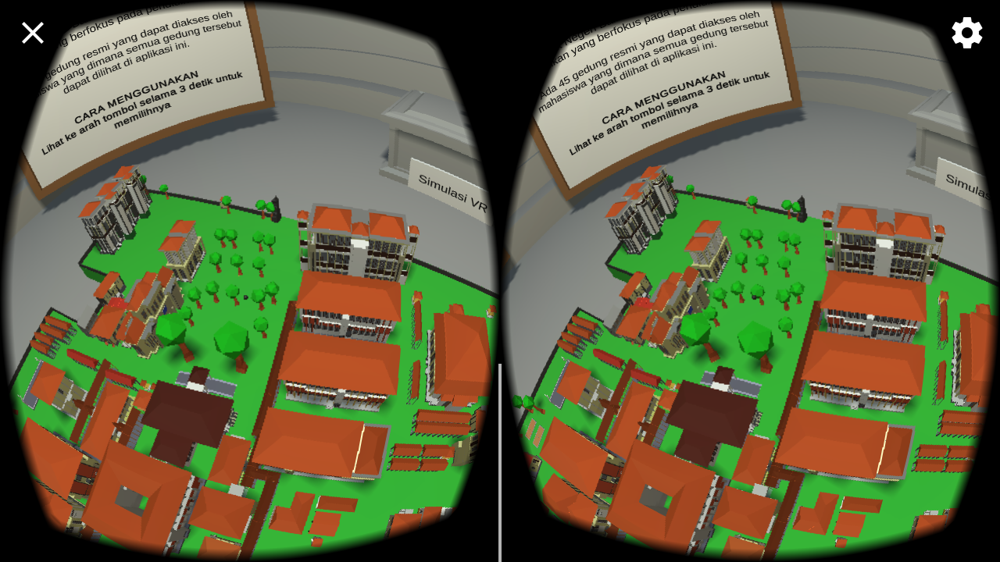

## Virtual Reality Politeknik Negeri Bali

**Selamat datang pengguna aplikasi Virtual Reality Politeknik Negeri Bali!**

Aplikasi Virtual Reality Politeknik Negeri Bali merupakan sebuah aplikasi virtual reality yang memuat informasi mengenai gedung - gedung yang ada di instansi Politeknik Negeri Bali. Aplikasi ini dibuat dengan tujuan untuk memberikan sebuah pengalaman kepada pengguna untuk memperoleh informasi mengenai Politeknik Negeri Bali dengan cara yang lebih modern.

Fitur yang terdapat dalam aplikasi terdiri atas:
- Pemilihan gedung Politeknik Negeri Bali
- Pemilihan informasi ekstra mengenai Politeknik Negeri Bali
- Mode Simulasi VR (Simulasi berjalan di lingkungan Politeknik Negeri Bali)
- Ganti Tampilan menjadi VR/Non VR

-> [Download Aplikasi](https://drive.google.com/open?id=1BPJ2AEsVc8V_H_S0WUiN_YQIJEDyN2TW) <-

<!--[Download PDF Laporan](https://drive.google.com/open?id=1zjmRpWf-or9dEfYg_EqZ90xNPiFQRP47)-->

<!--[Presentasi Laporan Tugas Akhir](https://drive.google.com/open?id=16oTgqlYQvny95n-x7NXXqZ-9BS8k_eE-P29Ju_Ug_j0)-->

Cara menggunakan :
- Pengguna menggerakkan smartphone pada tombol atau gedung yang ingin dituju dan tunggu selama 3 detik untuk mengaktifkan tombol atau gedung.

Dibuat dengan:
- Aplikasi: Unity 2018.4.4f1(64-bit)
- Model 3D: Blender 2.79b
- Gambar dalam Aplikasi: GIMP 2.10.10
